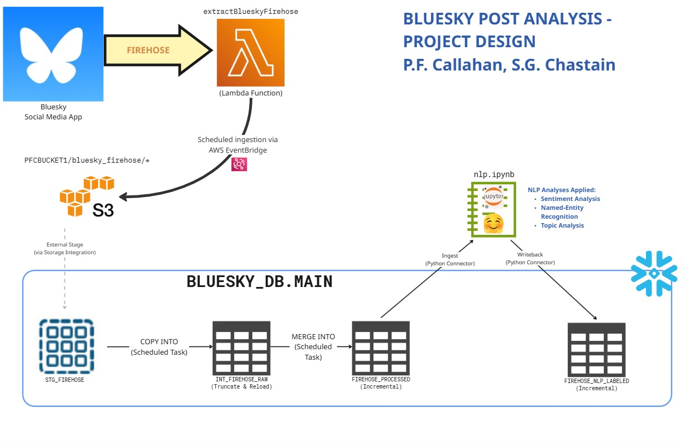

# What is this project? 

This is a project is focused on the Social Media app Bluesky. It uses NLP Modeling to attempt to get an understanding of what users generally like to talk about, and how they feel about those things.

## What is Bluesky?

[Bluesky](https://en.wikipedia.org/wiki/Bluesky) is a social media app that aims to offer a decentralized and user-controlled experience, similar to early iterations of the web. It originated as a project within Twitter, founded by Jack Dorsey, but later became an independent entity. The platform allows users to post short text updates, images, and videos, with a character limit and interface that often draws comparisons to Twitter (now X).

Key features of Bluesky include its reliance on the open-source [AT Protocol](https://atproto.com) (a.k.a. atproto), which enables transparency and allows users to potentially move their data and connections across different services. Users have significant control over their feeds through customizable algorithms and moderation tools, allowing for personalized content consumption. While it's growing rapidly, Bluesky's core appeal lies in its emphasis on user autonomy and fostering a more open, community-driven online space, contrasting with the more centralized control seen on other major platforms.

# Project Architecture

## Firehose and Jetstream

This project uses a feature of atproto called Firehose. It is an aggregated stream of all the public data updates in the Bluesky network. Working with it directly is possible, but it is more complex due to the Firehose wire format, since using that involves decoding binary CBOR data and CAR files. Jetstream, a side project originally written by Bluesky Engineer [Jaz](https://bsky.app/profile/jaz.bsky.social), provides an extremely efficient method for compressing Firehose data and serving it in an easily read JSON format. 

### For more information...

- [You can learn more about how Jetstream was created and the incredible efficiency gains Jaz was able to make possible in their blog post here](https://jazco.dev/2024/09/24/jetstream/).
- [For technical details on Jetstream, see the GitRepo](https://github.com/bluesky-social/jetstream)
- [For a live feed of Firehose (great to get a visual understanding), check out Firesky](https://firesky.tv/)

## Data Collection

We collect data with the following tech stack:

### For Ingestion...

1. **Python**
   1. [`boto3` (v 1.38.20)](https://aws.amazon.com/sdk-for-python/)
   2. [`websockets` (12.0)](https://websockets.readthedocs.io/en/stable/)
2. AWS 
   1. [S3 (for file storage)](https://aws.amazon.com/s3/)
   2. [Lambda (to execute the ingestion script)](https://aws.amazon.com/lambda/)
   3. [EventBridge (to trigger ingestions on Schedule)](https://aws.amazon.com/eventbridge/)
   4. [Elastic Container Registry (for containerizing the ingestion process)](https://aws.amazon.com/ecr/)
3. Snowflake
   1. This is our "landing zone" for raw and processed Bluesky data
   2. External Stages are used to view S3 Files in Snowflake
   3. Scheduled Tasks and Stored procedures are used to process raw data from Stage on Schedule

### For Modeling...

1. [Snowflake connector for Python](https://pypi.org/project/snowflake-connector-python/)
2. [PyTorch](https://pytorch.org/get-started/locally/)
3. [:hugs: Transformers](https://huggingface.co/docs/transformers/en/index)

### Execution pattern:

1. In AWS, the `extractBlueskyFirehose` is configured to open a websocket and listen to Jetstream for posts every 3 hours at 12 AM, 3 AM, 6 AM, and 9 AM, then again at 12 PM, 3 PM, 6 PM, and 9 PM

2. This process repeats 7 days a week

3. Each time a websocket is opened, the extraction lasts for 5 minutes

4. Once the extraction completes, the resulting .jsonl files are written to an S3 bucket

5. That S3 bucket is visible in Snowflake as an External Stage

6. From that stage, a stored procedure copies files into a Raw landing table called `INT_FIREHOSE_RAW`

   1. Here's a sample of one of those JSON files:

      ```json
      {
        "commit": {
          "cid": "bafyreiad3luasuqoeopagywpsgyfwtmrbh4hqqgg73gjax3ckptraov4ri",
          "collection": "app.bsky.feed.post",
          "operation": "create",
          "record": {
            "$type": "app.bsky.feed.post",
            "createdAt": "2025-06-09T07:16:56.665Z",
            "embed": {
              "$type": "app.bsky.embed.external",
              "external": {
                "description": "California National Guard arrived in Los Angeles on Sunday, deployed by President Donald Trump after two days of protests by hundreds of demonstrators against immigration raids carried out as part of Trump's hardline policy.",
                "thumb": {
                  "$type": "blob",
                  "mimeType": "image/jpeg",
                  "ref": {
                    "$link": "bafkreidbvptsujnvf55hr4ob43lpaihadwxblj22xjzqj54uqnesiq7lje"
                  },
                  "size": 647776
                },
                "title": "National Guard deployed in Los Angeles amid protests against immigration raids",
                "uri": "https://www.reuters.com/world/us/national-guard-deployed-los-angeles-amid-protests-against-immigration-raids-2025-06-08/"
              }
            },
            "facets": [
              {
                "features": [
                  {
                    "$type": "app.bsky.richtext.facet#link",
                    "uri": "https://www.reuters.com/world/us/national-guard-deployed-los-angeles-amid-protests-against-immigration-raids-2025-06-08/"
                  }
                ],
                "index": {
                  "byteEnd": 273,
                  "byteStart": 242
                }
              }
            ],
            "langs": [
              "en"
            ],
            "text": "California governor calls Trump National Guard deployment in LA unlawful\n\nThird day of immigration protests in Los Angeles\n\nDemocratic governor Newsom calls on Trump to withdraw troops\n\nNewsom announced law case against Federal Government \n\n www.reuters.com/world/us/nat..."
          },
          "rev": "3lr5tiu5sfi2f",
          "rkey": "3lr5tirb6wk24"
        },
        "did": "did:plc:h4dnm3ajj4r2mswd42e6ales",
        "kind": "commit",
        "time_us": 1749453420602509
      }
      ```

      

7. The sproc then processes the raw files into an Incremental Table called `FIREHOSE_PROCESSED`.

   1. A sample of the processed records can be seen below

   2. 

   3. | POST_CREATED_AT_TIMESTAMP     | FIRST_DETECTED_LANGUAGE | POST_TEXT                                                    |
      | ----------------------------- | ----------------------- | ------------------------------------------------------------ |
      | 2025-05-24 03:06:03.000 +0000 | Japanese                | 大腸がん発症、腸内細菌が出す毒素「コリバクチン」が関係…細胞の遺伝子を傷つける性質 https://www.yomiuri.co.jp/medical/20250524-OYT1T50055/ |
      | 2025-05-24 03:03:06.651 +0000 | English                 | More random records....                                      |
      | 2025-05-24 10:21:19.767 +0000 | Japanese                | 今までの人生で二度ほど「モーニングに連載してそうな絵柄」と言われたことがあるのが密かな誇り　でもモーニング自体は「昨日何食べた？」しかちゃんと読んだことが無く、どちらかというとアフタヌーンを愛読して育ったのですが… |
      | 2025-05-24 01:20:04.556 +0000 | English                 | Hey @majorarschloch.bsky.social thats your signal iirc       |
      | 2025-05-24 16:19:04.546 +0000 | English                 | Who dares disturb my Caturday celebrations of comfortably napping in a sunbeam?! Shoo! I have more napping to partake in! |
      | 2025-05-24 03:03:45.862 +0000 | English                 | I thought Cruella and Maleficent were my top two contenders for Disney's worst live action takes on their classic movies just because of the level of weird lore reworking they did in order to make these irredeemably evil protagonists Relatable™, but this is just insulting lol |
      | 2025-05-24 16:17:17.411 +0000 | English                 | Siden 1990 (cirka) har Norge øget det nationale N-udslip til havet med >400% og P-udslippet med >100%. Trods OSPARs 50% reduktionsmålsætning. Andre europæiske lande har reduceret udslippene. Min spådom: Norske farvande vil imudvikle sig til et large-scale ‘eutrophication problem area’. Trist. |
      | 2025-05-24 04:17:10.061 +0000 | Japanese                | え、普通に古文書とって突き進んでる                           |
      | 2025-05-24 04:17:25.534 +0000 | English                 | Soto is becoming an embarrassment.                           |
      | 2025-05-24 10:19:37.402 +0000 | English                 | FIGHTING THE GOOD FIGHT AGAINST THE WOKE AGENDA!!!           |

8. The processed data is then ingested into a Python Script that applies these NLP Workflows:

   

   | NLP Workflow                                                 | Model Used                                                   |
   | ------------------------------------------------------------ | ------------------------------------------------------------ |
   | [Sentiment Analysis](https://en.wikipedia.org/wiki/Sentiment_analysis) | [Twitter-roBERTa-base for Sentiment Analysis](https://huggingface.co/cardiffnlp/twitter-roberta-base-sentiment) |
   | [Named-Entity Recognition](https://en.wikipedia.org/wiki/Named-entity_recognition) | [dslim/bert-base-NER](https://huggingface.co/dslim/bert-base-NER) |

   A sample of the final data looks like this: 

   | TIMESTAMP_POST_CREATED  | POST_TEXT                                                    | SENTIMENT_DETECTED_LABEL | SENTIMENT_CONFIDENCE_SCORE | NER_DETECTED_GROUP | NER_DETECTED_ENTITY | NER_CONFIDENCE_SCORE |
   | ----------------------- | ------------------------------------------------------------ | ------------------------ | -------------------------- | ------------------ | ------------------- | -------------------- |
   | 2025-06-08 18:22:00.111 | #TacoGestapo                                                 | Neutral                  | 0.7079                     | Organization       | TacoGestapo         | 0.9582               |
   | 2025-06-08 18:21:59.501 | Queer ally Paladin is ready for Pride!                       | Positive                 | 0.7334                     | Miscellaneous      | Pride!              | 0.7154               |
   | 2025-06-08 18:21:59.406 | How do you think she and Trump would react if a Democratic governor sent this out today? | Neutral                  | 0.8209                     | Miscellaneous      | Democratic          | 0.9997               |
   | 2025-06-08 18:21:59.406 | How do you think she and Trump would react if a Democratic governor sent this out today? | Neutral                  | 0.8209                     | Person             | Trump               | 0.9995               |
   | 2025-06-08 18:21:59.376 | #LosAngeles #NationalGuard #ICE #Immigration Dictators often provoke people and incite anger through human rights violations or other inflammatory actions. When the masses react, they are blamed for breaking the law, giving the dictator an excuse to use violence against them and justify repression. | Negative                 | 0.9320                     | Organization       | LosAngeles          | 0.8174               |

# Architecture Diagram



